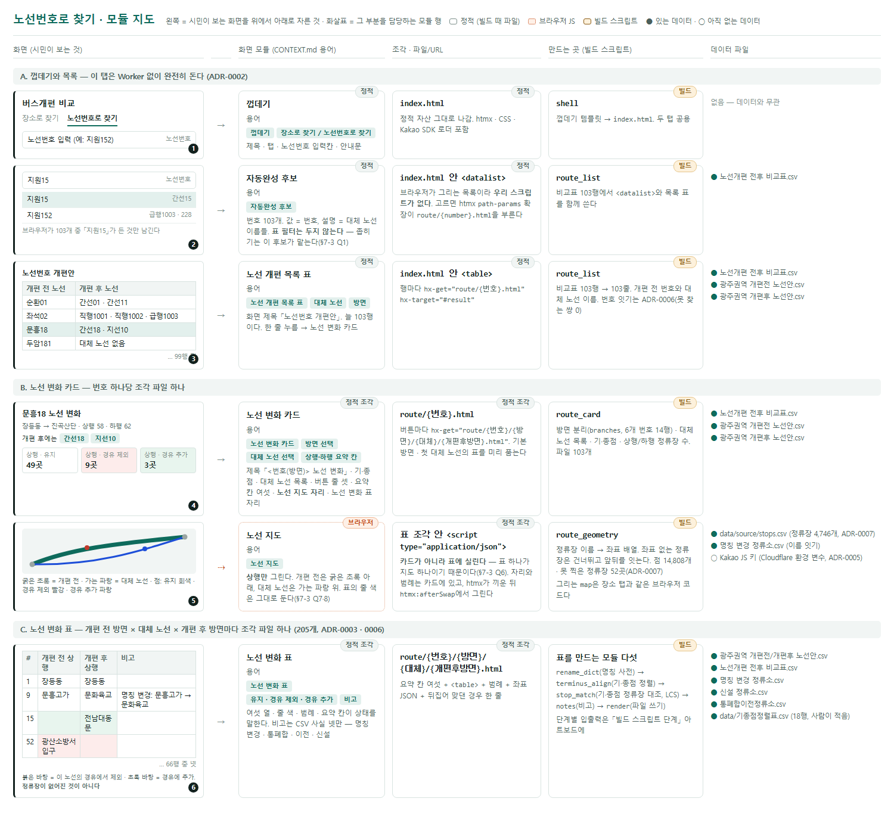
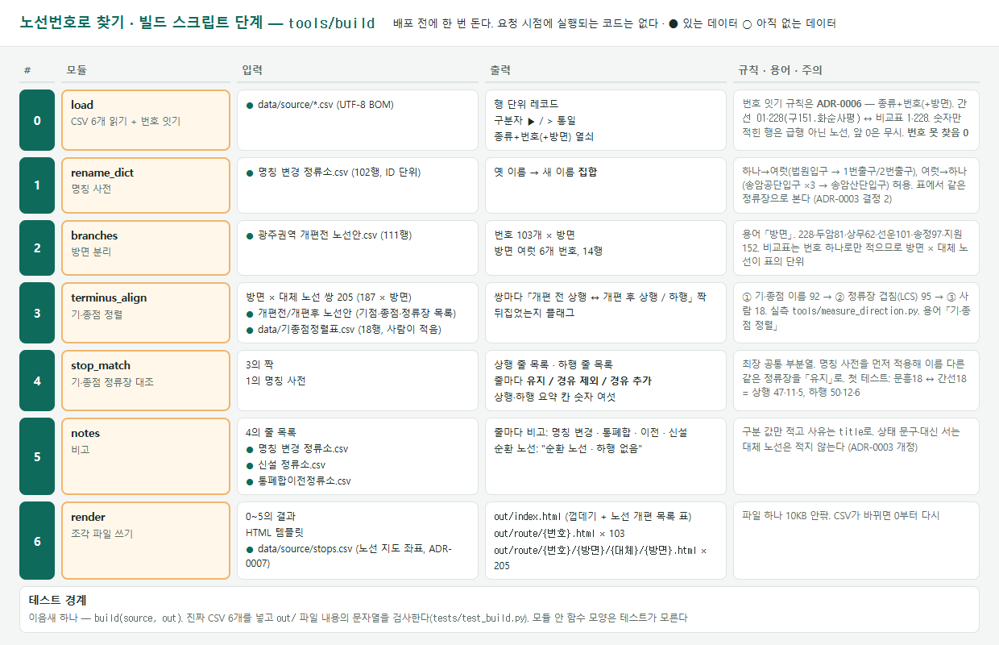
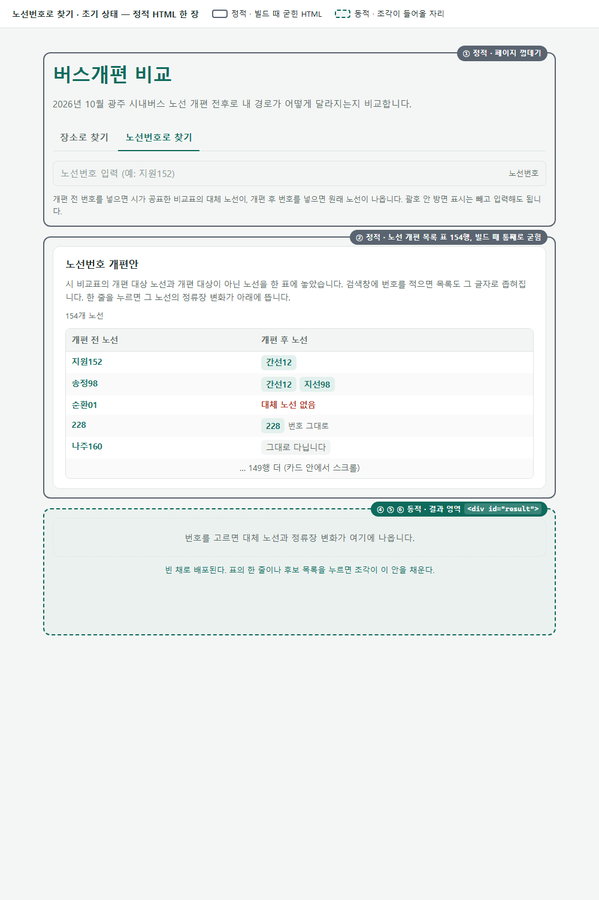
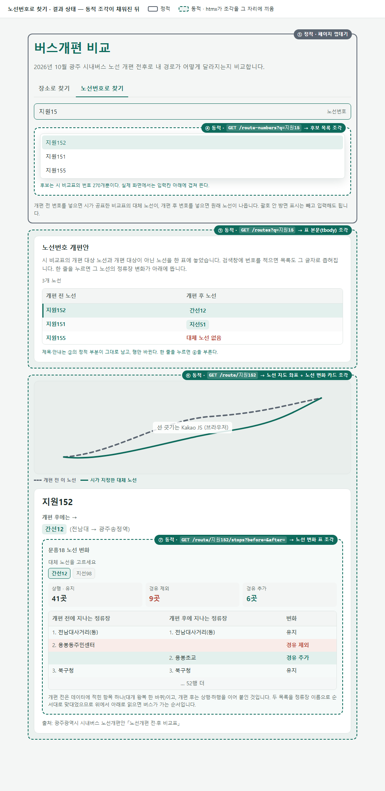
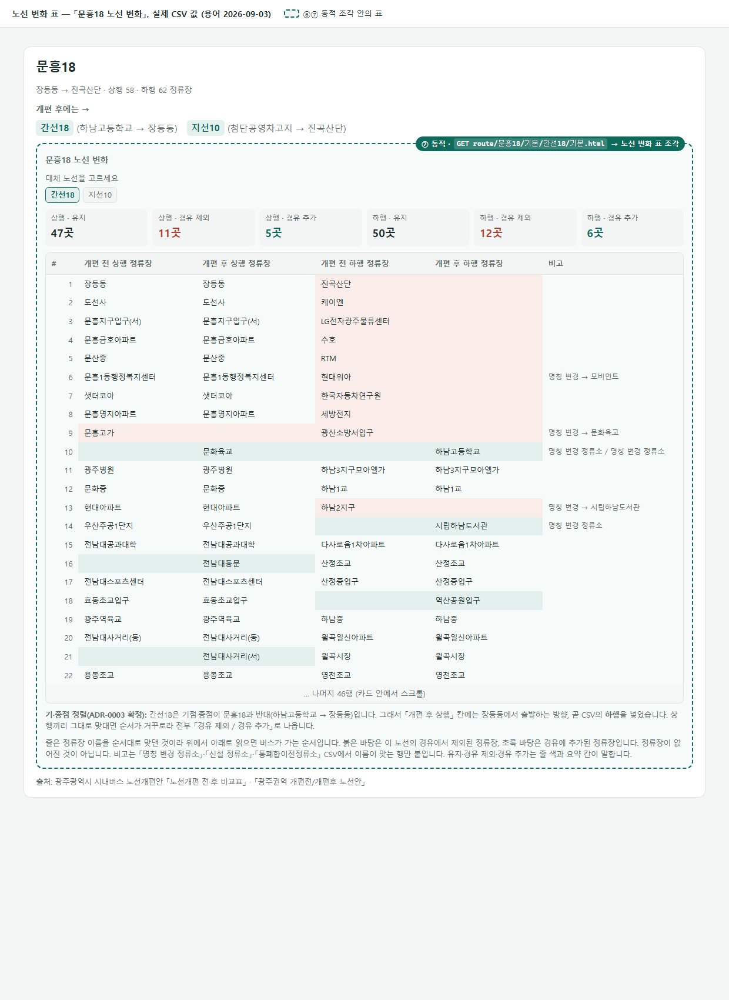
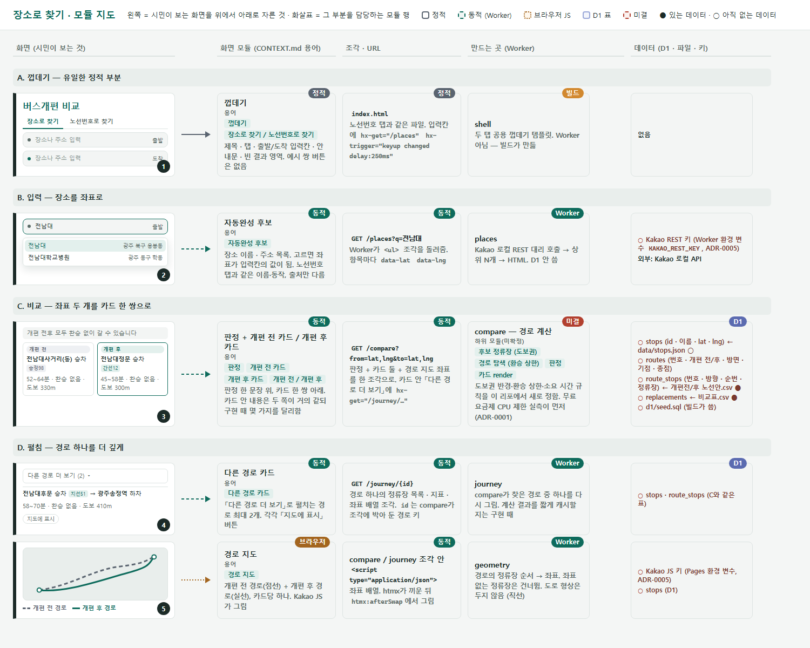
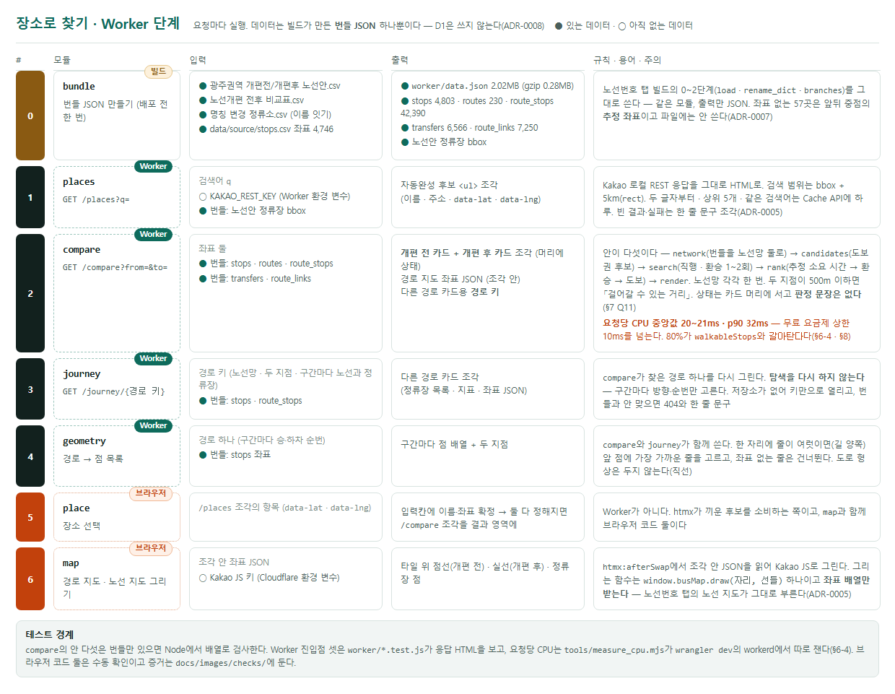
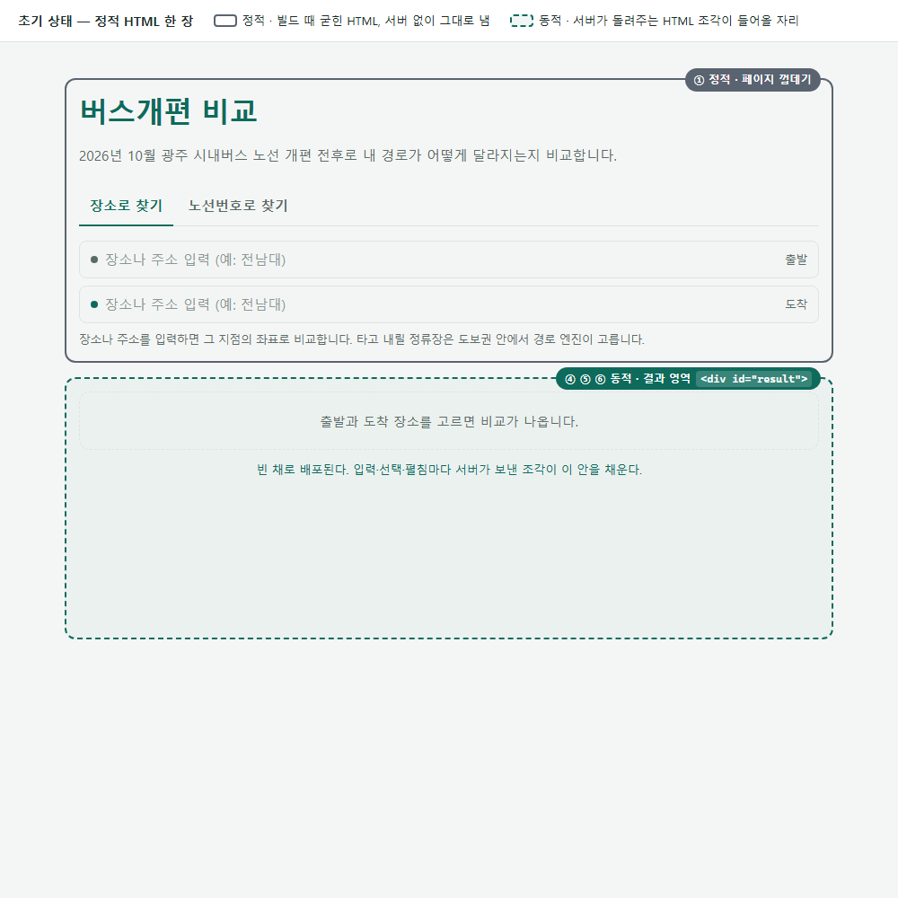
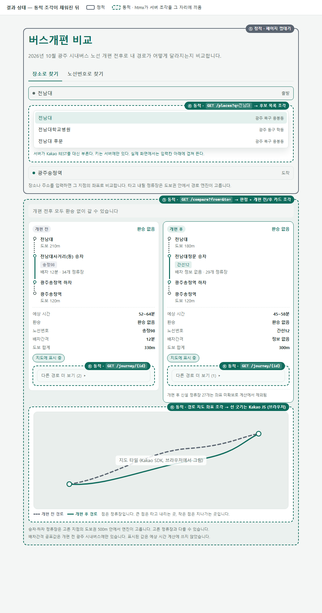
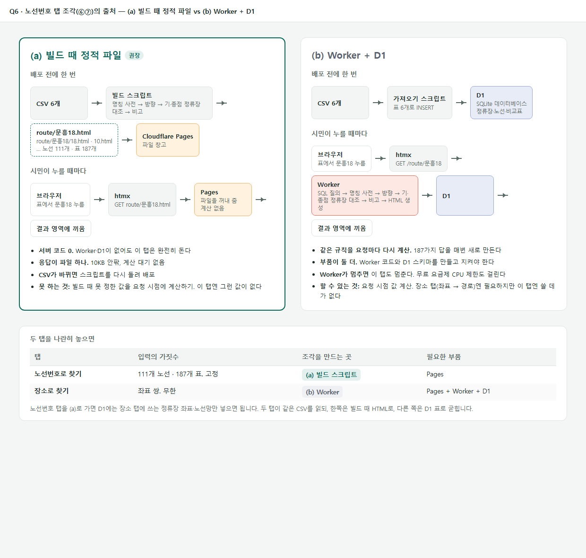

# gwangju-bus-reform-compare

2026년 10월 광주 시내버스 노선 개편 전후를 시민이 비교하는 웹 서비스.
탭 둘: **장소로 찾기**(출발·도착 장소를 넣으면 개편 전후 경로를 비교)와
**노선번호로 찾기**(번호를 넣으면 대체 노선과 노선 변화 표를 보여 줌).

구조는 **정적 HTML + htmx 조각**이다. 이유와 부품별 역할은 `docs/architecture.md`에 있다.

## 새로 합류했다면 이 순서로 읽는다

1. `CONTEXT.md` — 용어. 방면·대체 노선·조각·유지/경유 제외/경유 추가 같은 말의 뜻
2. `docs/architecture.md` — 구조와 부품 역할, 두 탭의 정적/동적 분할, 데이터 흐름, 결정 요약
3. `docs/adr/` — 되돌리기 어려운 결정 여덟과 그 이유 (0004는 0007로, 0001의 D1 부분은 0008로 대체됨)
4. `data/README.md` — 원천 CSV 6개의 열과 행 수, 정류장 좌표(`source/stops.csv`), 알아 둘 함정
5. **모듈 지도** — https://claude.ai/code/artifact/6977a9d4-929e-40d8-a252-9620cb46f86b
   탭마다 두 장: 모듈 지도(화면 조각 → 화면 모듈 → 조각 → 만드는 곳(빌드 스크립트 / Worker) → 데이터, 정적/동적·용어·데이터 있음/예정)와
   만드는 곳의 단계(단계별 입력·출력·테스트 경계). 구현·유지보수 때 보는 것. 같은 그림이 `docs/images/`에 PNG로 있다(아래)
6. 화면 목업 — https://claude.ai/code/artifact/fbf89d71-17a6-4f49-b963-aa3eb506b539
   (페이지 4장: 장소 탭 분할 · 노선번호 탭 분할 · 노선 변화 표 · 조각 출처 a vs b. 용어는 2026-09-03 확정본). PNG는 아래

## 그림 (캔버스 없이 볼 때)

캔버스에서 렌더링한 PNG. 캔버스가 바뀌면 다시 뽑는다(`docs/images/README.md`).

### 노선번호로 찾기











### 장소로 찾기









### 조각 출처 a vs b (Q6)



## 배포 (Cloudflare Workers)

Worker 이름 `gwangju-bus-reform-compare`. Workers Builds가 `main`에 push될 때마다 리포를 받아
`python -m tools.build`로 `out/`을 만들고, `wrangler.jsonc`대로 `out/`을 정적 자산으로 올린다.
Worker 코드는 아직 없다(노선번호 탭은 정적 파일만으로 돈다, ADR-0002).

대시보드 빌드 설정(리포 밖, 한 번만): 빌드 명령 `python -m tools.build` · 배포 명령 `npx wrangler deploy` · 루트 `/`.
로컬 확인: `python -m tools.build && npx wrangler deploy --dry-run`.

## 빌드와 테스트

```
python -m tools.build     # data/source → out/ (정적 조각) + worker/data.json (번들 JSON)
python -m pytest          # 빌드 검사 — out/의 조각과 번들 JSON을 본다
npm test                  # Worker 검사 — 빌드를 한 번 돌린 뒤 node --test
npm run deploy:dry        # wrangler deploy --dry-run
```

`out/`과 `worker/data.json`은 빌드 산출물이라 저장소에 없다. **배포도 테스트도 빌드가 먼저다.**

## 상태 (2026-09-04)

**노선번호 탭이 정적 파일로 돈다.** `python -m tools.build`가 `out/`에 껍데기 `index.html` 한 장(노선 개편 목록 표 103줄)과
노선 변화 카드 103개 · 노선 변화 표 205개를 쓴다. `out/`을 정적 서버로 열면 목록의 한 줄을 눌러 카드를,
카드의 버튼을 눌러 표를 새로고침 없이 바꿀 수 있다 — Worker도 D1도 없이(ADR-0001·0002).

**장소 탭은 데이터가 먼저 들어왔다.** 같은 빌드가 `worker/data.json`도 쓴다 — 정류장 4,803줄(`stops.csv`
4,746 + 추정 좌표 57) · 노선 230(개편 전 111 + 개편 후 119) · 노선별 정류장 42,390줄, 압축 전 1.53MB.
Worker(`worker/index.js`)는 아직 뼈대라 `/places` · `/compare` · `/journey/…`가 「준비 중」 조각을
돌려주고, 나머지 주소는 전과 똑같이 정적 자산으로 나간다. 화면의 입력칸도 아직 자리뿐이다.
설계는 2026-09-03에 닫혔다 — `docs/architecture.md` §7 표와 ADR-0008.

번호 잇기 규칙은 ADR-0006으로 닫혔고 못 찾는 쌍 0이다. 정류장 좌표도 들어왔다 —
`data/source/stops.csv` 4,746개, 결측 0(ADR-0007). 다음 단계는 `docs/architecture.md` §9 「다음 할 일」.
